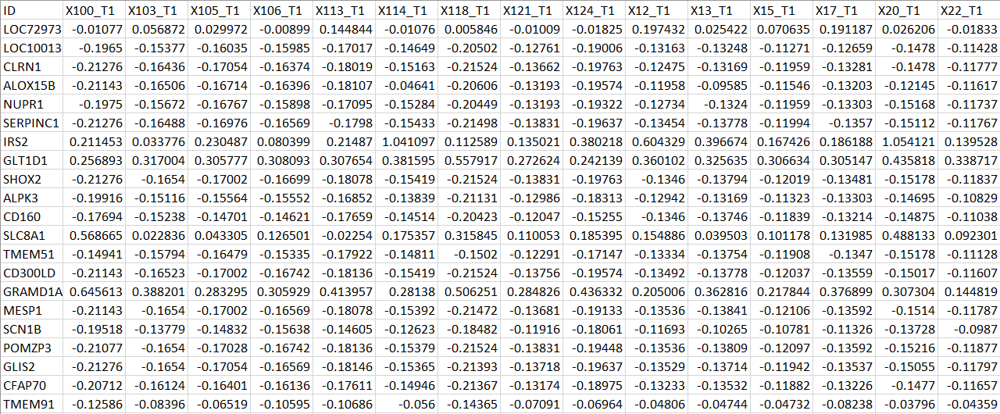

# cymirCNV
## A cytoscape plugin for miRNA-gene correlation network visualization

cymirCNV is a Cytoscape plug-in designed for constructing and visualizing miRNA-gene correlation networks from expression data. It supports Pearson and Spearman correlation analysis, allowing users to explore regulatory interactions with customizable thresholds. Ideal for researchers studying miRNA-mediated gene regulation, cymirCNV streamlines data preprocessing, correlation computation, and network visualization within Cytoscape.

# cymiRCNV: A Step-by-Step Tutorial
## A Cytoscape plug-in for miRNA-Gene Correlation Network Analysis

## 1. Introduction
cymiRCNV is a Cytoscape plug-in designed for constructing and visualizing miRNA-gene correlation networks from expression data. It supports Pearson and Spearman correlation analysis and allows users to explore regulatory interactions interactively.

## 2. Installation
### Method 1: Install from Cytoscape App Store
Open Cytoscape.
Go to Apps → App Manager.
Search for cymiRCNV.
Click Install and wait for the installation to complete.
Restart Cytoscape to enable the plug-in.
### Method 2: Manual Installation (Alternative)
Download the cymiRCNV JAR file from the Cytoscape App Store or GitHub.
In Cytoscape, go to Apps → App Manager → Install from File.
Select the downloaded cymiRCNV JAR file and click Open.
Restart Cytoscape to apply changes.

## 3. Preparing Input Data  

To use **cymiRCNV**, you need **paired gene and miRNA expression data** from the **same samples**.  

#### File Format  
- The data should be in **CSV** format.  
- The **first column** should contain **miRNA or gene IDs**.  
- The **remaining columns** should contain **expression values** for each sample (recommended to use normalized count).  
- **Sample IDs must match exactly** between miRNA and gene expression datasets.  

#### Example: miRNA Expression Data  

### Example: gene Expression Data

## 🚨 Important Notes:
### ✔ File format: Ensure the data is correctly formatted (no missing values & normalized).
### ✔ Matching columns: The sample IDs must be identical in both miRNA and gene expression datasets.
