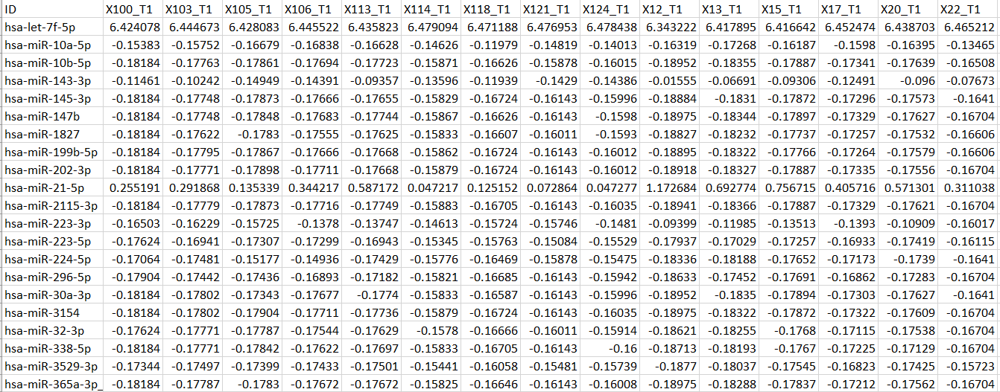

# cymiRCNV
## A Cytoscape plug-in for miRNA-Gene Correlation Network Analysis

## 1. Introduction
cymirCNV is a Cytoscape plug-in designed for constructing and visualizing miRNA-gene correlation networks from expression data. It supports Pearson and Spearman correlation analysis, allowing users to explore regulatory interactions with customizable thresholds. Ideal for researchers studying miRNA-mediated gene regulation, cymirCNV streamlines data preprocessing, correlation computation, and network visualization within Cytoscape.

## 2. Installation
### Method 1: Install from Cytoscape App Store
- Open Cytoscape.
- Go to Apps → App Manager.
- Search for cymiRCNV.
- Click Install and wait for the installation to complete.
- Restart Cytoscape to enable the plug-in.
### Method 2: Manual Installation (Alternative)
- Download the cymiRCNV JAR file from the Cytoscape App Store or GitHub.
- In Cytoscape, go to Apps → App Manager → Install from File.
- Select the downloaded cymiRCNV JAR file and click Open.
- Restart Cytoscape to apply changes.

## 3. Preparing Input Data  

To use **cymiRCNV**, you need **paired gene and miRNA expression data** from the **same samples**.  

#### File Format  
- The data should be in **CSV** format.  
- The **first column** should contain **miRNA or gene IDs**.  
- The **remaining columns** should contain **expression values** for each sample (recommended to use normalized count).  
- **Sample IDs must match exactly** between miRNA and gene expression datasets.  

#### Example: miRNA Expression Data (Download Example ([ miRNA Expression file](example_data/miRNA.csv)))

### Example: gene Expression Data

## 🚨 Important Notes:
- ✔ File format: Ensure the data is correctly formatted (no missing values & normalized).
- ✔ Matching columns: The sample IDs must be identical in both miRNA and gene expression datasets.
- ✔ For optimal performance and meaningful insights, it is recommended to use a filtered subset of the expression data containing only differentially expressed miRNAs (DEMs) and differentially expressed genes (DEGs). Additionally, the data should be properly normalized to ensure accurate correlation analysis. Constructing a correlation network using the entire count dataset is not only computationally intensive but may also introduce noise, reducing the biological relevance of the results.

## 4. Running cymiRCNV in Cytoscape
### Step 1: Load the Expression Data
- Open Cytoscape.
- Navigate to Apps → cymiRCNV.
- Select the miRNA expression file (CSV).
- Select the gene expression file (CSV).
- Click Open – a preview of the data will be displayed.
### Step 2: Choose Correlation Method and thresholds
- Select Pearson correlation (for linear relationships) or Spearman correlation (for rank-based relationships).
- Set a correlation threshold (e.g., 0.7 for strong correlations).
- Set p-value cutoff (default: <0.05)
- Click Run Analysis – cymiRCNV will generate a correlation-based miRNA-gene network.
### Step 3: Network Visualization
- The miRNA-gene correlation network will appear in the Cytoscape workspace.
- Nodes represent miRNAs (e.g., red) and genes (e.g., blue).
- Edges represent correlation (white edges for positive and red edges for negative correlations).
- Use Cytoscape’s layout options to adjust the visualization.
